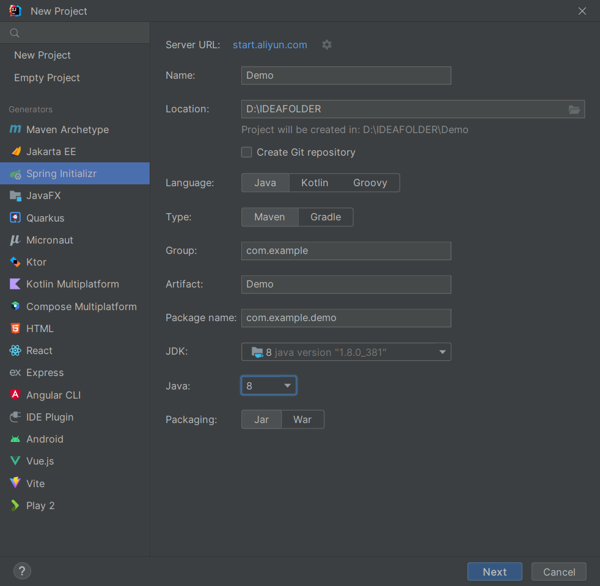
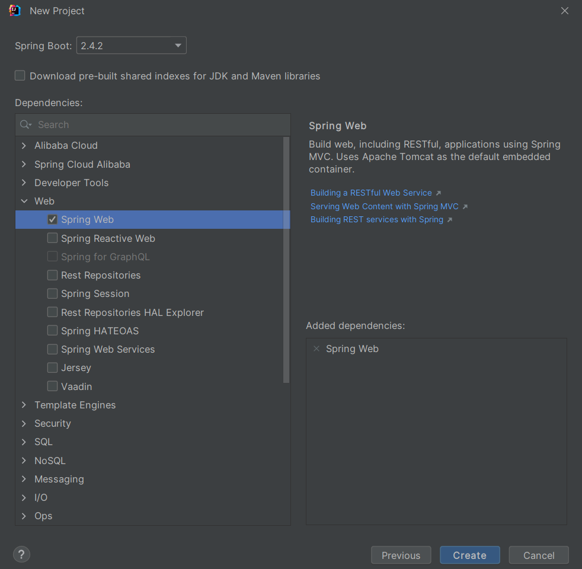
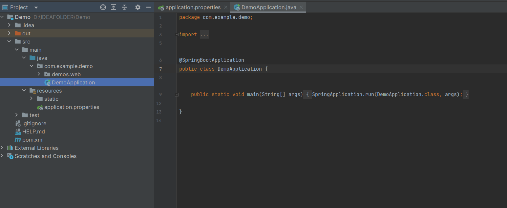
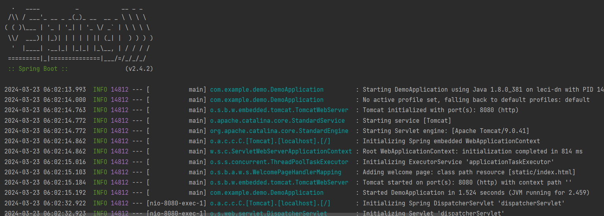
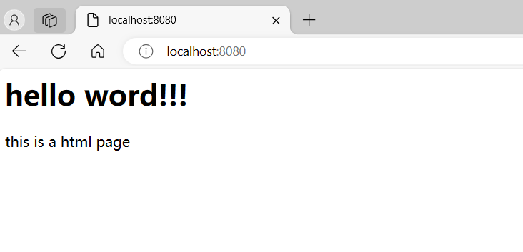

# SpringBoot
Personal SpringBoot learning materials

## 使用idea快速创建第一个SpringBoot项目

启动idea--新建项目--选择Spring Initializr

ServerURL:https://start.aliyun.com Spring服务器地址

Name:项目名（自取英文）

Location:项目存放路径

Type:Maven(项目管理工具)

Group:域名后缀.域名

Artifact:工件（一般为项目名）

Package name:域名后缀.域名.项目名(无符号且小写)

JDK：JAVA_JDK

JAVA:解释版本

Packaging:打包方式后缀

点击Next

添加Spring Web模块

点击Create

默认会创建SpringBoot项目启动类以及Spring核心配置文件

右击启动类文件，运行（run）该类

控制台显示Spring Boot启动的相关信息

在浏览器访问localhost:8080

显示如下界面

